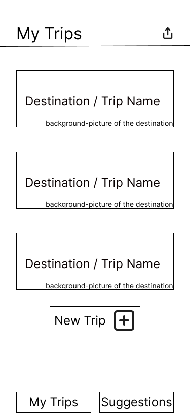
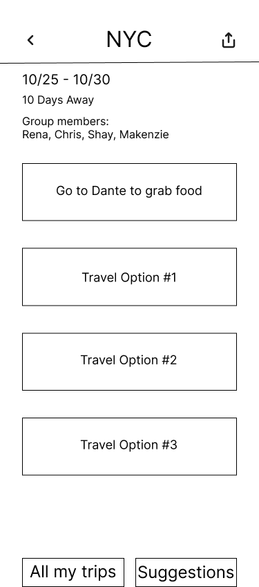

# User Experience Design
## [Prototype](https://www.figma.com/proto/jRMiVkZ56BUOCgAwpaiRPL/wireframe-and-prototype?page-id=30%3A39&node-id=36-85&node-type=frame&viewport=822%2C336%2C0.59&t=9XHM5kpDNNLp0oBv-1&scaling=scale-down&content-scaling=fixed&starting-point-node-id=36%3A85)

## App map and Wireframe

### App map

### Wireframe

* Title: All My Trips
* This is the main page of our app. Users begin using the app with this page. It has a list of all the upcoming trips, in the order of the earlist start date. 

* Title: Trip Plans
* Users are able to see the detail information of the selected trip.

* Title: Planning
* A page where users add all their drafts of possible plans. They can have group members vote on the suggestions, as well as adding certain suggestions to the final plan.

* Title: Create Trip
* This is the page to create a new trip. Users need to fill required informations.

The diagrams must be displayed in a logical order and in a visual size that is easy to view when posted on GitHub.com.
Make this document easy-to-read, with clear headings and sub-headings, and good formatting of text.
For the wireframe diagrams, include the title of each diagram, as well as a simple explanation of the purpose of the screen it represents.
Any functionality of the screen that is not obvious should be written into the document.